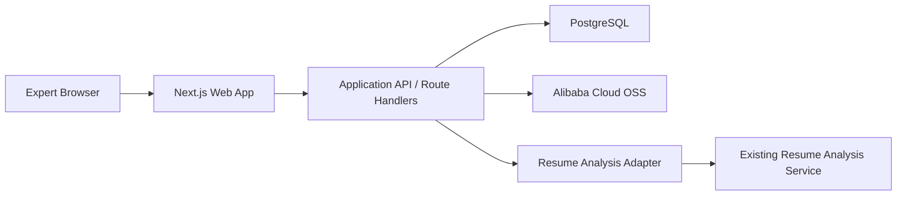

# 10 System Architecture

## 1. 架构目标

围绕专家申请流程实现以下能力：

- 安全识别专家身份
- 支持中断恢复
- 稳定上传大文件
- 异步复用既有简历分析服务
- 用状态机驱动页面和业务流转

## 2. 总体架构



## 3. 逻辑分层

### 3.1 表现层

- 专家端页面
- 多步骤流程 UI
- 上传组件
- 动态缺失字段表单

### 3.2 应用层

- token 校验
- 申请状态机流转
- 分析任务编排
- 材料上传元数据管理
- 提交幂等控制

### 3.3 基础设施层

- PostgreSQL
- 阿里云 OSS
- Sentry
- 既有简历分析服务

## 4. 关键流程设计

### 4.1 访问与恢复流程

1. 专家通过带 `token` 的链接访问
2. Next.js 服务端校验 token
3. 创建或恢复 `application`
4. 服务端写入 `HttpOnly cookie`
5. 前端根据申请快照跳转到当前步骤

### 4.2 简历上传与分析流程

1. 前端请求简历上传凭证
2. 后端生成 OSS 上传凭证
3. 前端直传 OSS
4. 上传完成后调用确认接口写入 `resume_file`
5. 应用层调用既有简历分析服务创建异步任务
6. 保存 `analysis_job_id`
7. 前端轮询分析状态
8. 完成后拉取结构化结果并更新申请状态

### 4.3 信息不足补填流程

1. 分析结果返回 `missing_fields`
2. 前端动态渲染结构化表单
3. 专家提交补充信息
4. 后端保存 `supplemental_field_submission`
5. 后端再次调用分析服务
6. 更新结果与申请状态

### 4.4 材料上传与提交流程

1. 前端按材料分类申请上传凭证
2. 前端直传 OSS
3. 后端写入 `application_material`
4. 前端展示回显
5. 点击提交时调用幂等提交接口
6. 状态改为 `SUBMITTED`

## 5. 状态驱动策略

建议以 `application_status` 作为页面跳转和权限控制的唯一业务真源。

状态如下：

- `INIT`
- `INTRO_VIEWED`
- `CV_UPLOADED`
- `CV_ANALYZING`
- `INFO_REQUIRED`
- `REANALYZING`
- `INELIGIBLE`
- `ELIGIBLE`
- `MATERIALS_IN_PROGRESS`
- `SUBMITTED`
- `CLOSED`

页面恢复规则：

- 以后端状态为准
- 前端不自行推断流程
- 若状态与局部数据不一致，以服务端快照修正

## 6. token 与会话设计

### 6.1 token 规则

- token 来源：由一段字符串生成的 hash 加密字符串
- token 有效期：动态配置
- token 非一次性
- token 允许多设备打开

### 6.2 安全建议

- token 必须高熵且不可猜测
- 数据库存储时建议保存 token 摘要而非明文
- token 失效、禁用、过期需要独立状态管理
- 首次校验成功后写入短期 `HttpOnly` 会话 cookie

### 6.3 多设备策略

- 同一 token 可在多个设备打开
- 每个设备建立独立短期会话
- 所有设备共享同一申请状态

## 7. 文件上传与存储设计

### 7.1 文件类型

- 简历：
  - PDF
  - Word
- 证明材料：
  - PDF
  - Word
  - 压缩包

### 7.2 文件大小限制

- 单文件：20MB
- 压缩包：100MB

### 7.3 上传设计

- 使用 OSS 预签名直传
- 上传成功后必须走确认接口登记元数据
- 文件记录必须与 `application_id` 和材料分类绑定

### 7.4 文件安全

- 不直接暴露底层对象存储地址
- 下载时通过受控接口或短期签名地址
- 删除采用业务层软删除优先

## 8. 分析服务适配设计

### 8.1 适配目标

统一既有简历分析项目的输出结构，屏蔽旧项目内部实现差异。

### 8.2 推荐内部接口

- `POST /internal/resume-analysis/jobs`
- `GET /internal/resume-analysis/jobs/{jobId}`
- `GET /internal/resume-analysis/jobs/{jobId}/result`

### 8.3 标准结果结构

- `eligibility_result`
- `reason_text`
- `display_summary`
- `extracted_fields`
- `missing_fields`

### 8.4 缺失字段结构

每个字段建议包含：

- `field_key`
- `label`
- `type`
- `required`
- `help_text`
- `options`
- `default_value`

## 9. 提交幂等设计

提交接口必须避免重复提交造成状态错乱。

建议方案：

- 为 `submit` 接口增加幂等键
- 若当前状态已是 `SUBMITTED`，直接返回已提交成功响应
- 在数据库层保证同一申请只有一个最终提交结果

## 10. 推荐目录结构

```text
src/
  app/
    (public)/
      apply/
        page.tsx
      apply/resume/
        page.tsx
      apply/result/
        page.tsx
      apply/materials/
        page.tsx
    api/
      expert-session/route.ts
      applications/[applicationId]/intro/confirm/route.ts
      applications/[applicationId]/resume/route.ts
      applications/[applicationId]/analysis-status/route.ts
      applications/[applicationId]/analysis-result/route.ts
      applications/[applicationId]/supplemental-fields/route.ts
      applications/[applicationId]/materials/route.ts
      applications/[applicationId]/submit/route.ts
  components/
  features/
    application/
    upload/
    analysis/
    materials/
  lib/
    auth/
    db/
    oss/
    resume-analysis/
    validation/
    logger/
```

## 11. 建议后续补充的实现细节

- token 生成与轮换策略
- OSS 对象 key 命名规范
- 文件病毒扫描策略
- 提交前是否做材料完整性提示
- 管理端后续如何读取申请状态与材料摘要
