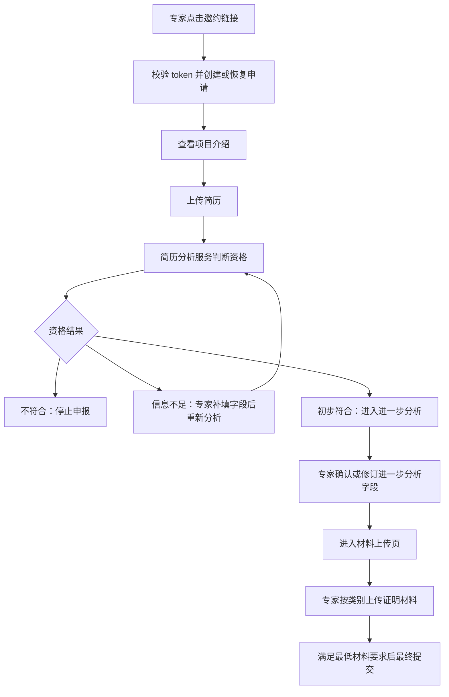
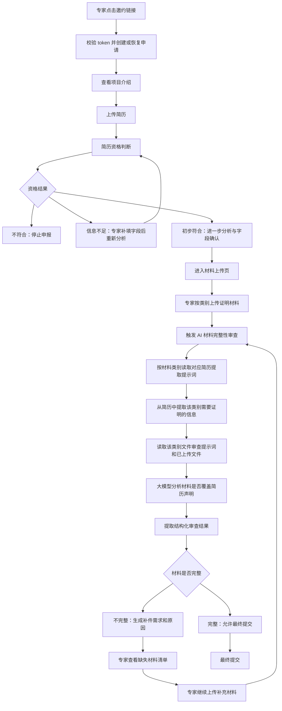

# 11 AI Material Supplement Design

## 1. 背景

当前系统已经完成专家邀约、简历资格判断、材料上传与最终提交的主流程。后续若希望根据专家简历和已上传材料，自动判断哪些证明材料缺失、哪些简历声明尚未提供证明，并生成可沟通、可补传、可复查的补件需求，则需要在现有专家申报流程中增加一套 AI 材料完整性审查闭环。

该能力的目标不是替代现有简历资格判断，而是在专家进入材料阶段后，帮助系统和专家确认材料是否足以支撑简历中的关键经历、学历、荣誉、专利、项目、产品等申报内容。

## 2. 产品定位

该功能应定位为现有 AutoHire 系统的后续阶段扩展：

- 当前系统：简历资格判断 -> 收集专家材料 -> 最终提交
- 后续系统：简历资格判断 -> 收集专家材料 -> AI 材料完整性审查 -> 生成补件需求 -> 专家查看并补传 -> 再次审查 -> 材料完整后提交

因此，新增能力本质上是“材料收集后的智能补件闭环”，仍然围绕当前 `Application` 申请主线展开。

## 3. 流程图

### 3.1 当前系统流程

当前系统主要完成专家身份恢复、简历资格判断、专家材料收集和最终提交。



### 3.2 未来系统流程

未来系统在材料上传后增加 AI 材料完整性审查。审查流程以材料类别为单位：先用各类别简历提示词从简历中提取对应信息，再结合该类别已上传文件和该类别文件审查提示词，让大模型判断材料是否足以证明简历中的声明，最后提取审查结果并生成补件需求。



## 4. 需要新增的功能模块

### 4.1 材料类别与提示词配置模块

该模块负责维护每一类证明材料对应的分析规则和提示词。未来材料审查不应只使用一个通用提示词，而应按材料类别分别处理。

每个材料类别建议至少维护两类提示词：

- 简历信息提取提示词：用于从简历中提取该类别需要证明的信息
- 类别文件审查提示词：用于结合该类别文件判断材料是否能证明简历声明

示例类别：

- Identity Documents
- Employment Documents
- Education Documents
- Honor Documents
- Patent Documents
- Project Documents
- Paper Documents
- Book Documents
- Conference Documents
- Product Documents

该模块需要支持后续持续调整提示词，因为不同材料类别的证明标准、判断依据和输出格式会不断迭代。

### 4.2 按类别提取简历信息模块

该模块负责在材料审查开始时，按材料类别从简历中提取需要证明的信息。

处理方式：

- 读取专家简历原文或现有简历提取结果
- 遍历材料类别
- 对每个类别调用对应的简历提取提示词
- 产出该类别下的待证明简历信息

示例输出：

```text
Education Documents:
- 博士学位：University of Example, 2018
- 硕士学位：Example Institute, 2013

Employment Documents:
- 当前单位：XXX University
- 职位：Professor
- 任职时间：2020 至今

Patent Documents:
- Patent A
- Patent B
```

该模块的作用是先明确“简历中哪些内容需要证明”，再进入材料文件审查。

### 4.3 类别材料 AI 审查模块

该模块负责将“某类别从简历中提取的信息”“该类别已上传的文件”“该类别文件审查提示词”一起提交给大模型，让 AI 判断当前材料是否足以证明简历声明。

每个类别独立分析，避免不同材料类型之间互相干扰。

主要输入：

- 当前材料类别
- 该类别的简历提取结果
- 该类别已上传的材料文件
- 该类别文件审查提示词
- 必要的文件文本、图片或文件引用

主要输出：

- 哪些简历声明已被材料证明
- 哪些简历声明没有找到对应证明
- 哪些材料无法识别或无法确认
- 哪些材料类别仍需补充
- 缺失原因和建议上传的材料类型

该模块是未来补件闭环的核心判断能力。

### 4.4 文件内容准备模块

在把材料交给大模型分析之前，系统需要准备可供模型理解的文件内容。

该模块需要根据模型能力和文件类型选择合适方式：

- 对 PDF、Word 等文件提取文本
- 对图片、扫描件、证书进行 OCR 或直接交给支持视觉能力的大模型
- 对压缩包进行文件拆分和清单识别
- 保留文件名、上传类别、文件类型等上下文信息
- 标记文件无法读取、格式异常、内容为空等情况

该模块不直接判断材料是否完整，而是为类别材料 AI 审查提供可靠输入。

### 4.5 审查结果提取与标准化模块

大模型产出的原始结果需要被提取为系统可展示、可追踪、可再次审查的结构化结果。

该模块负责：

- 解析每个类别的大模型审查输出
- 提取缺失材料项
- 提取缺失原因
- 提取对应的简历声明
- 提取建议上传的材料类型
- 合并不同类别下重复或相近的补件需求
- 标记已满足、待补充、无法确认等结果状态

该模块要避免前端直接消费大模型原文。前端应展示经过标准化后的补件需求。

### 4.6 AI 补件需求生成模块

该模块负责把材料审查结果转化为专家可以理解、可以操作的补件需求。

每条补件需求建议包含：

- 需求标题
- 缺失或不明确的原因
- 关联的简历声明
- 建议上传的证明材料类型
- 是否必需
- 当前处理状态
- 面向专家的说明文案

示例：

```text
博士学历证明缺失

原因：简历中填写了博士学位，但当前上传材料中未识别到博士学位证、学历认证或其他等效证明。

建议上传：博士学位证、学历证明、学历认证报告。
```

### 4.7 专家补件沟通模块

该模块负责将 AI 生成的补件需求传达给专家。

第一阶段建议优先支持站内查看，即专家通过原邀约链接或会话回到系统后，直接看到当前补件清单。

后续可扩展为邮件通知：

- 系统生成补件邮件正文
- 邮件中包含回到补件页面的链接
- 记录邮件发送、打开、点击等状态
- 专家点击链接后继续补传材料

建议将“沟通内容生成”和“实际发送渠道”解耦。第一期可以先生成沟通需求和站内展示，邮件发送作为后续增强。

### 4.8 补传与再次审查模块

专家看到补件清单后，应能针对每条需求继续上传材料。上传后系统需要重新解析新增材料，并重新判断该补件项是否已满足。

该模块需要支持：

- 针对补件项上传材料
- 显示每条补件需求的处理状态
- 新材料上传后触发再次审查
- 自动关闭已满足的补件项
- 对仍不满足的补件项继续保留或更新说明

目标是形成一个可循环的闭环，而不是一次性生成补件意见后结束。

### 4.9 人工复核兜底模块

AI 对材料完整性的判断可能存在误判，尤其是在证明材料格式不统一、扫描质量较差、跨语言文件较多的情况下。

建议后续预留人工复核能力：

- 查看 AI 审查结果
- 查看每条补件需求的依据
- 人工确认、驳回或修改 AI 补件需求
- 对低置信度判断进行人工处理

第一期可以不做完整后台，但应在产品设计上保留人工介入空间。

## 5. 前端页面设计

### 5.1 总体原则

前端不建议新增一个与当前流程割裂的新入口，而应围绕现有材料上传阶段继续扩展。

推荐将 `/apply/materials` 从“材料上传页”升级为“材料管理与补件工作台”。

页面应帮助专家完成三件事：

- 看懂当前材料是否完整
- 明确知道还缺什么、为什么缺
- 能直接按需求继续上传材料

### 5.2 材料上传页增强

现有 `/apply/materials` 可以继续保留材料分类上传能力，同时增加以下区域：

- 当前材料审查状态
- 材料完整度摘要
- 必需材料完成情况
- AI 补件需求入口
- 每个材料分类下的缺失提示

示例展示：

```text
材料完整性检查

当前仍需补充 3 项材料。请根据下方提示上传对应证明文件，系统会在上传后重新检查。
```

材料分类区可继续保留现有结构：

- Identity Documents
- Employment Documents
- Education Documents
- Honor Documents
- Patent Documents
- Project Documents
- Paper / Book / Conference / Product 等扩展分类

每个分类下可以展示：

- 已上传文件
- 该分类下相关补件需求
- 上传入口
- 文件解析或审查状态

### 5.3 补件清单视图

可以在 `/apply/materials` 内通过独立区域展示，也可以使用 `/apply/materials?view=supplement` 作为补件视图。

建议按卡片或分组列表展示补件需求：

```text
你还需要补充 3 项材料

1. 博士学历证明
原因：简历中填写了博士学位，但当前未找到对应学位证书或学历证明。
建议上传：博士学位证、学历证明、认证报告。
[上传材料]

2. 当前工作单位证明
原因：简历中填写当前单位为 XXX University，但未找到对应在职证明。
建议上传：在职证明、雇佣合同、单位证明信。
[上传材料]
```

每条补件需求应展示：

- 需求标题
- 缺失原因
- 关联简历内容
- 建议上传材料
- 当前状态
- 上传按钮

状态建议包括：

- 待补充
- 已上传，等待检查
- 已满足
- 需要人工确认
- 无法识别，请重新上传或补充说明

### 5.4 审查中状态页或状态区

材料上传后，系统需要解析文件并运行 AI 审查。前端应提供清晰反馈，避免专家误以为系统卡住。

可以展示：

```text
系统正在检查你的补充材料

我们正在读取新上传的文件，并判断它是否能证明对应的简历内容。请稍候，页面会自动更新。
```

如果审查耗时较长，应支持刷新后恢复状态。

### 5.5 材料完整页面

当 AI 判断材料完整后，页面应明确提示专家可以继续提交：

```text
材料检查已完成

当前上传材料已覆盖申报所需的核心证明项。请确认信息无误后提交。
```

此时可以解锁最终提交按钮，或者提示进入最终确认页。

### 5.6 专家沟通需求展示

AI 生成的沟通需求不应只作为内部记录，也应该在专家端以清晰、友好的方式呈现。

展示文案应避免技术化表达，例如避免直接说“AI 判断失败”“字段未匹配”。应使用专家能理解的表达：

- “我们还没有找到能够证明这段经历的材料”
- “请上传能证明当前工作单位的文件”
- “该证书图片较模糊，系统无法确认姓名和授予单位”

### 5.7 移动端体验

专家可能通过邮件在手机端打开链接，因此补件页面需要支持移动端：

- 补件需求按单列展示
- 上传按钮清晰可见
- 文件状态简洁明确
- 不在移动端展示过宽表格
- 长文件名需要截断但保留完整 title 或详情查看

## 6. 是否需要账号功能

第一阶段不建议新增账号体系，建议继续使用当前的邀约 token + HttpOnly session 模式。

原因：

- 当前业务是邀约制，不是开放注册制
- 一个 token 已经能定位一个 invitation 和 application
- 专家只需要完成自己的申报与补件
- 补件流程可以通过原链接恢复
- 引入账号会增加注册、登录、找回密码、多设备、安全策略等额外复杂度

当前 token 模式已经适合这些场景：

- 专家从邮件进入系统
- 系统识别专家身份
- 专家中断后恢复进度
- 专家根据补件提示继续上传材料
- 邮件通知中携带回访链接

但可以增强现有会话安全：

- token 保持高熵且只保存 hash
- 首次访问后写入短期 HttpOnly session
- token 过期后支持重新发送访问链接
- 对敏感操作继续校验 application 归属

后续如果出现以下需求，再考虑账号体系：

- 专家需要长期维护个人资料库
- 一个专家会参与多个项目或多次申报
- 专家需要主动登录查看历史申请
- 系统需要多角色权限，例如专家、审核员、管理员、运营人员
- 需要更严格的身份认证或 MFA

因此建议路线是：先不做账号，继续扩展当前邀约访问模型；当业务从一次性申报演进为长期专家门户时，再引入账号系统。

## 7. 推荐实施路线

### 7.1 第一阶段：站内补件闭环 MVP

目标是让专家能够在现有系统中看到缺失材料，并继续补传。

建议范围：

- 新增材料类别与提示词配置能力
- 新增按类别从简历中提取待证明信息的能力
- 新增按类别结合文件和提示词进行 AI 材料审查的能力
- 新增审查结果提取与标准化能力
- 生成结构化补件需求
- 在 `/apply/materials` 展示补件清单
- 专家按补件项继续上传材料
- 上传后重新检查并更新需求状态

该阶段不强依赖邮件发送、不强依赖账号系统、不强依赖完整人工审核后台。

### 7.2 第二阶段：补件沟通增强

目标是让系统能主动通知专家补件，并记录沟通过程。

建议范围：

- 生成补件邮件正文
- 邮件通知专家
- 邮件链接回到补件页面
- 记录发送状态、打开状态、点击状态
- 支持补件需求变更后再次通知

该阶段重点是把站内补件清单变成可触达专家的沟通机制。

### 7.3 第三阶段：人工复核与审核工作台

目标是降低 AI 误判风险，让业务人员可以介入材料审查。

建议范围：

- 审核人员查看材料审查结果
- 查看 AI 判断依据和置信度
- 人工确认、驳回、修改补件需求
- 人工触发再次通知
- 记录人工处理意见

该阶段可以逐步发展为管理端能力。

### 7.4 第四阶段：专家账号或专家门户

只有当专家需要长期使用系统时，再考虑账号体系。

适合引入账号的时机：

- 专家有多个申请或多个项目
- 专家资料需要长期复用
- 专家需要主动维护个人档案
- 系统需要完整权限体系

在此之前，继续使用 token 邀约链路更轻、更贴合当前业务。

## 8. 建议结论

该需求应作为当前 AutoHire 的自然延展，在现有系统中继续开发，而不是新建一个割裂的系统。

推荐方向：

- 保持 `Application` 作为业务主线
- 将材料页升级为材料管理与补件工作台
- 按材料类别维护提示词，并按类别提取简历信息、审查类别文件
- 使用标准化结果生成结构化补件需求
- 让专家可以直接查看、理解并补传
- 上传后再次审查，形成循环闭环
- 第一阶段不新增账号功能
- 后续根据业务复杂度再扩展邮件通知、人工审核和专家门户
