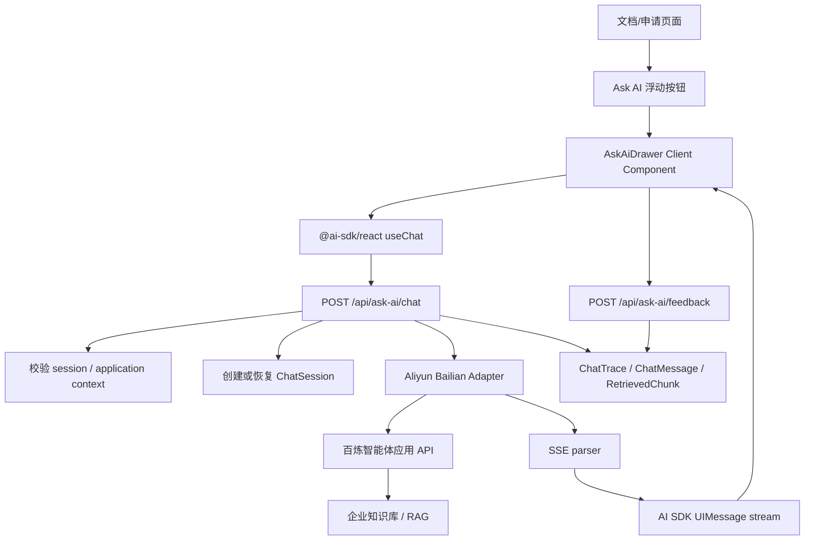

# 12 Ask AI RAG Chatbot Plan

## 1. 背景与目标

本计划面向 AutoHire 文档页和申请流程页面增加一个基于企业文档/知识库的 Ask AI 问答入口。入口固定在页面右下角，点击后打开侧边抽屉，不打断主流程。机器人使用 Vercel AI SDK 和 AI Elements 构建前端聊天体验，后端通过 Next.js Route Handler 代理阿里云百炼智能体应用 API，避免把阿里云 API Key 暴露给浏览器。

目标能力：

- 文档页右下角 Ask AI 浮动入口。
- 侧边抽屉聊天，不跳转页面，不阻塞当前申请流程。
- 流式输出答案。
- 展示企业文档/知识库引用来源。
- 支持 thumbs up/down、复制、重新生成、清空会话。
- 记录 trace：用户问题、检索 chunks、相似度/分数、最终回答、供应商 request id、反馈、耗时、错误。
- 与现有 Application/session/tracking 体系对齐，支持后续质量评估和问题回放。

## 2. 当前项目现状

### 2.1 技术栈

当前项目为 Bun 管理的 Next.js App Router 应用：

- Next.js `16.2.3`
- React `19.2.5`
- Tailwind CSS v4
- Prisma `7.7.0`
- PostgreSQL
- lucide-react
- react-markdown
- Sentry
- Bun scripts: `bun run dev`, `bun run build`, `bun run test`, `bun run test:e2e`

### 2.2 UI 组件现状

项目目前没有 `components.json`，`bunx --bun shadcn@latest info --json` 返回 `config: null`、`components: []`。现有 `src/components/ui` 只有：

- `badge.tsx`
- `markdown-prose.tsx`
- `page-shell.tsx`

因此 AI Elements 不能直接安装使用，需要先初始化 shadcn/ui，再按需加入基础组件和 AI Elements 组件。

### 2.3 后端与数据现状

现有后端结构适合接入该能力：

- API Routes 位于 `src/app/api/**/route.ts`。
- 环境变量统一在 `src/lib/env.ts` 用 Zod 校验。
- 通用 JSON 错误处理在 `src/lib/http.ts`。
- 通用事件记录已有 `ApplicationEventLog` 和 `/api/track`。
- 申请主线表为 `Application`，已有 `applicationId`、session cookie、request id 等上下文。

建议新增专用 AI chat/trace 表，而不是把完整检索片段和模型响应塞进 `ApplicationEventLog.eventPayload`。通用事件表继续记录轻量行为事件，AI trace 表保存可回放、可评估的问答细节。

## 3. 文档调研结论

### 3.1 Vercel AI SDK

Context7 查询到 Vercel AI SDK 官方文档说明：

- `@ai-sdk/react` 的 `useChat` 管理前端消息、输入和 streaming 状态。
- Next.js Route Handler 可使用 `streamText()`、`convertToModelMessages()`、`toUIMessageStreamResponse()` 返回 UI message stream。
- RAG 可以通过 `tool()` 暴露 `getInformation` 检索工具。
- 消息持久化场景建议使用 `validateUIMessages()` 校验历史消息、tool schema 和 data parts。
- 对于外部 SSE 或自定义数据，AI SDK 提供 `createUIMessageStream()` 与 `createUIMessageStreamResponse()`，可以写入 `text-start`、`text-delta`、`text-end`、`source-url`、`data-*` 等自定义 parts。

对本项目的影响：

- 如果直接调用模型 provider，可使用 `streamText()`。
- 如果调用阿里云智能体应用 API，更适合用 `createUIMessageStream()` 把阿里云 SSE 转成 AI SDK UI message stream，再由 `useChat` 消费。

### 3.2 AI Elements

AI Elements 是 Vercel AI SDK 生态下基于 shadcn/ui 的 AI UI 组件集合。官方资料显示它提供：

- Conversation：消息容器和自动滚动。
- Message：角色化消息展示。
- Response：Markdown/代码等响应渲染。
- PromptInput：输入框、发送按钮、附件扩展。
- Tool / Reasoning：工具调用和推理状态展示。
- Sources / Citation：引用来源展示。
- Actions：复制、重新生成等 response actions。

对本项目的影响：

- UI 不建议手写完整聊天组件。
- 初始化 shadcn 后，优先安装 `conversation`、`message`、`response`、`prompt-input`、`sources`、`actions`，再按需要加入 `tool`、`reasoning`。

### 3.3 shadcn/ui

shadcn 技能和 CLI 查询结果显示本项目尚未初始化 shadcn。由于 AI Elements 基于 shadcn/ui，计划中必须包含：

- 运行 `bunx --bun shadcn@latest init` 初始化。
- 使用 Tailwind v4 的 CSS variables 模式。
- 添加基础组件：`sheet`、`button`、`textarea`、`tooltip`、`sonner`、`scroll-area`。
- Sheet/Dialog 类组件必须有可访问标题。
- 图标按钮使用 lucide-react，按钮内图标遵循 shadcn 组件规范。

### 3.4 阿里云百炼智能体应用 API

阿里云官方文档显示，百炼智能体应用支持 API 调用和流式输出：

- 普通应用调用 endpoint 形态为 `/api/v1/apps/{appId}/completion`。
- HTTP 流式输出需要设置 header `X-DashScope-SSE: enable`。
- 增量输出需要在 `parameters` 中设置 `incremental_output: true`。
- 流式响应为 SSE，`data` 中包含 `output.session_id`、`output.finish_reason`、`output.text`、`usage`、`request_id`。
- 智能体应用支持知识库 RAG，检索内容会占用上下文窗口，需要控制检索策略和文本长度。
- 另一类 SseChat 文档显示知识库答案可返回 `AnswerReference.ItemList`，其中包含 `Title`、`Content`、`DataSource`、`ReferenceExt.DocName` 等引用信息。实际采用哪一种响应结构，需要以当前百炼控制台发布渠道的 API 文档为准。

对本项目的影响：

- 后端需要一个阿里云 adapter，统一解析应用 API 的 SSE。
- 必须把阿里云 `session_id` 与本地 `chatSession` 绑定，支持多轮对话。
- 引用来源字段需要兼容两类结构：应用 completion 的 debug/thoughts/chunk 信息，以及 SseChat 的 `AnswerReference.ItemList`。
- API Key 只能在服务端环境变量中保存。

## 4. 推荐架构



## 5. 前端实施计划

### 5.1 依赖与组件初始化

新增依赖建议：

- `ai`
- `@ai-sdk/react`
- AI Elements CLI 安装的源代码组件
- shadcn 基础组件依赖，由 shadcn CLI 管理

执行顺序：

1. 初始化 shadcn/ui。
2. 添加 `sheet button textarea tooltip sonner scroll-area`。
3. 安装 AI Elements 需要的组件。
4. 检查生成文件 import alias 是否为 `@/`。
5. 保留现有自写 UI，不做无关替换。

### 5.2 组件拆分

建议新增：

- `src/features/ask-ai/components/ask-ai-entry.tsx`
- `src/features/ask-ai/components/ask-ai-drawer.tsx`
- `src/features/ask-ai/components/ask-ai-message-actions.tsx`
- `src/features/ask-ai/components/ask-ai-sources.tsx`
- `src/features/ask-ai/lib/types.ts`

`ask-ai-entry.tsx` 为 Client Component，负责浮动按钮和抽屉开关。它可以挂在 `src/app/(public)/apply/layout.tsx` 或更高层布局中。文档页若未来是独立 route，也复用同一入口组件。

### 5.3 UI 行为

侧边抽屉：

- 桌面端从右侧打开，宽度约 `min(420px, 100vw)`。
- 移动端宽度 `100vw` 或接近全屏，保留关闭按钮。
- 抽屉使用 shadcn Sheet，包含可访问的 `SheetTitle`。
- 消息区使用 AI Elements Conversation。
- 输入区固定在抽屉底部，使用 PromptInput。

消息能力：

- assistant 消息支持 Markdown。
- source/citation 展示文档标题、章节、片段序号、得分、跳转 URL。
- 回答完成后显示复制、重新生成、thumbs up/down。
- 重新生成应复用上一条用户问题，并创建新的 assistant trace attempt。
- 清空会话只清空当前本地/服务端会话，不删除审计 trace，可把 session 标记为 cleared。

### 5.4 页面接入点

优先接入：

- `src/app/(public)/apply/layout.tsx`
- 后续可接入独立文档页面或后台文档页布局。

接入时需要避免影响申请主流程：

- 不改变页面路由。
- 不改变表单提交状态。
- 不劫持页面滚动。
- 不把抽屉状态写入申请业务状态。

## 6. 后端实施计划

### 6.1 API Routes

新增 API：

- `POST /api/ask-ai/chat`
  - 接收 AI SDK UI messages、chat session id、当前页面上下文。
  - 校验用户 session 和 applicationId。
  - 调用阿里云 adapter。
  - 返回 AI SDK UI message stream。
  - 持久化用户问题、最终回答、sources、usage、request id、耗时、错误。

- `POST /api/ask-ai/feedback`
  - 接收 `chatSessionId`、`assistantMessageId`、`rating`、可选 comment。
  - 支持 up/down 覆盖更新。
  - 写入反馈表和轻量 tracking event。

- `POST /api/ask-ai/clear`
  - 标记当前会话 cleared。
  - 前端清空消息列表。

可选后台 API：

- `GET /api/internal/ask-ai/traces`
  - 用于内部查看 trace、按 application/question/request id 检索。

### 6.2 阿里云 Adapter

建议新增：

- `src/lib/ask-ai/aliyun-client.ts`
- `src/lib/ask-ai/sse-parser.ts`
- `src/lib/ask-ai/trace-service.ts`
- `src/lib/ask-ai/types.ts`

Adapter 责任：

- 从 `getEnv()` 读取 `ASK_AI_ALIYUN_API_KEY`、`ASK_AI_ALIYUN_APP_ID`、`ASK_AI_ALIYUN_BASE_URL`。
- POST 到 `{baseUrl}/api/v1/apps/{appId}/completion`。
- 设置 `Authorization: Bearer ...`、`Content-Type: application/json`、`X-DashScope-SSE: enable`。
- 请求体使用：

```json
{
  "input": {
    "prompt": "用户问题",
    "session_id": "阿里云上轮 session_id，如文档/控制台确认支持",
    "biz_params": {
      "applicationId": "本地申请 ID",
      "page": "当前页面",
      "locale": "zh-CN"
    }
  },
  "parameters": {
    "incremental_output": true
  },
  "debug": {}
}
```

注意：`session_id` 的位置、引用字段、debug 字段需要按当前百炼控制台“API 调用”页实际文档确认。本计划保留 adapter 层隔离这些供应商差异。

### 6.3 AI SDK Stream 转换

`POST /api/ask-ai/chat` 不直接把阿里云 SSE 透传给前端，而是转换为 AI SDK UI message stream：

- 收到第一个 token 时写 `text-start`。
- 每个 `output.text` 写 `text-delta`。
- 收到 `finish_reason: stop` 写 `text-end`。
- 解析到引用来源时写 `source-url` 或自定义 `data-source`。
- 解析到检索 chunks 时写 `data-retrieval`，包含 title、chunk、score、doc id。
- 结束时触发 trace 持久化。

这样前端仍然使用 `useChat` 和 AI Elements，不需要理解阿里云 SSE 协议。

## 7. 数据模型计划

建议新增 Prisma enum：

```prisma
enum AskAiFeedbackRating {
  UP
  DOWN
}

enum AskAiSessionStatus {
  ACTIVE
  CLEARED
}
```

建议新增模型：

```prisma
model AskAiChatSession {
  id                  String             @id @default(cuid())
  applicationId        String?
  aliyunSessionId      String?
  status              AskAiSessionStatus @default(ACTIVE)
  startedAt           DateTime           @default(now())
  lastMessageAt        DateTime?
  clearedAt           DateTime?
  pageName            String?
  sessionId           String?
  requestId           String?
  createdAt           DateTime           @default(now())
  updatedAt           DateTime           @updatedAt

  application          Application?       @relation(fields: [applicationId], references: [id])
  messages             AskAiChatMessage[]

  @@index([applicationId, createdAt])
  @@index([aliyunSessionId])
  @@index([sessionId, createdAt])
}

model AskAiChatMessage {
  id                  String             @id @default(cuid())
  chatSessionId        String
  role                String
  content             String             @db.Text
  uiMessageId         String?
  aliyunRequestId     String?
  latencyMs           Int?
  tokenUsage          Json?
  errorCode           String?
  errorMessage        String?            @db.Text
  rawResponse         Json?
  createdAt           DateTime           @default(now())

  chatSession          AskAiChatSession   @relation(fields: [chatSessionId], references: [id])
  retrievedChunks      AskAiRetrievedChunk[]
  feedback             AskAiMessageFeedback?

  @@index([chatSessionId, createdAt])
  @@index([aliyunRequestId])
}

model AskAiRetrievedChunk {
  id                  String             @id @default(cuid())
  messageId           String
  sourceId            String?
  documentTitle       String?
  documentUrl         String?
  sectionTitle        String?
  chunkText           String?            @db.Text
  score               Float?
  rank                Int?
  metadata            Json?
  createdAt           DateTime           @default(now())

  message             AskAiChatMessage    @relation(fields: [messageId], references: [id])

  @@index([messageId, rank])
  @@index([sourceId])
}

model AskAiMessageFeedback {
  id                  String              @id @default(cuid())
  messageId           String              @unique
  rating              AskAiFeedbackRating
  comment             String?             @db.Text
  applicationId       String?
  sessionId           String?
  requestId           String?
  createdAt           DateTime            @default(now())
  updatedAt           DateTime            @updatedAt

  message             AskAiChatMessage     @relation(fields: [messageId], references: [id])

  @@index([rating, createdAt])
  @@index([applicationId, createdAt])
}
```

如果需要更轻的第一版，可先合并 `AskAiRetrievedChunk` 到 `AskAiChatMessage.rawResponse`，但正式版本建议拆表，便于按 chunk score 做质量分析。

## 8. 环境变量

新增：

```text
ASK_AI_MODE=mock | live
ASK_AI_ALIYUN_BASE_URL=https://dashscope.aliyuncs.com
ASK_AI_ALIYUN_API_KEY=
ASK_AI_ALIYUN_APP_ID=
ASK_AI_DEFAULT_LOCALE=zh-CN
ASK_AI_TRACE_RAW_RESPONSE=false
ASK_AI_MAX_QUESTION_CHARS=1000
ASK_AI_TIMEOUT_MS=60000
```

本地开发默认 `ASK_AI_MODE=mock`，以便不依赖真实百炼服务跑单元测试和 UI 测试。

## 9. Trace 与反馈策略

每次问答记录：

- 本地 chat session id。
- applicationId，可为空以支持纯文档页。
- 页面名和路由。
- 用户问题。
- 供应商 request id。
- 阿里云 session id。
- 检索 chunks：doc、section、chunk、score、rank、metadata。
- 最终回答。
- token usage。
- latencyMs。
- 错误码和错误消息。
- thumbs up/down 和可选 comment。

隐私与安全：

- 不记录 API Key。
- 如回答或 chunk 含敏感个人材料，内部 trace 查看 API 必须加管理员鉴权。
- `rawResponse` 是否保存由 `ASK_AI_TRACE_RAW_RESPONSE` 控制。
- 对用户问题长度做限制，避免恶意超长输入。

## 10. 测试计划

单元测试：

- `sse-parser.test.ts`：解析阿里云 SSE、增量文本、finish reason、request id、异常 JSON。
- `aliyun-client.test.ts`：mock fetch，验证 header、body、timeout、错误映射。
- `trace-service.test.ts`：保存 question/answer/chunks/feedback。
- `route.test.ts`：校验请求 schema、session context、mock stream。

组件测试：

- 抽屉开关。
- 输入、发送、loading/streaming 状态。
- 复制按钮。
- thumbs up/down 状态切换。
- 清空会话。
- sources 展开/折叠。

E2E：

- 在申请页右下角打开 Ask AI。
- 提问后看到流式答案。
- 展示引用来源。
- 点 thumbs up/down 后刷新仍保留反馈。
- 清空会话后当前 UI 为空，但后台 trace 仍存在。

## 11. 分阶段实施

### Phase 0: 文档与确认

- 确认百炼控制台应用 API 的实际 endpoint、region、session_id 传参位置、引用字段结构。
- 确认企业知识库是否由百炼托管，还是需要本项目自建文档库同步。
- 确认 Ask AI 只覆盖 public apply 页面，还是包括后台文档页。

### Phase 1: UI 基建

- 初始化 shadcn/ui。
- 安装基础组件和 AI Elements 组件。
- 新增 Ask AI 浮动入口和 Sheet 抽屉。
- 使用 mock API 完成聊天 UI、复制、重新生成、清空、反馈交互。

### Phase 2: 后端 mock 与数据模型

- 新增 Prisma models 和 migration。
- 新增 `src/lib/ask-ai` mock client。
- 新增 `/api/ask-ai/chat`、`/api/ask-ai/feedback`、`/api/ask-ai/clear`。
- 保存 trace 和反馈。

### Phase 3: 阿里云 live 接入

- 实现阿里云 SSE adapter。
- 将阿里云 SSE 转为 AI SDK UI message stream。
- 保存 request id、session id、usage、chunks、sources。
- 增加错误、超时、取消处理。

### Phase 4: 质量与运营

- 建内部 trace 查看页面或导出脚本。
- 建立低质量反馈样本集。
- 增加 no-answer、低 score、无引用答案的告警或统计。
- 根据真实反馈调整百炼知识库检索策略和提示词。

## 12. 风险与开放问题

- AI Elements 需要先初始化 shadcn，会引入一批 UI 源码文件，需要控制变更范围。
- 阿里云智能体应用 API 的不同发布渠道返回结构可能不一致，必须用 adapter 隔离。
- 百炼托管知识库是否能稳定返回 chunk score 和完整引用，需要实际应用配置验证。
- 如果 Ask AI 覆盖专家申请流程，问题和回答可能包含个人材料信息，trace 查看必须有权限边界。
- 当前项目 `ApplicationEventLog` 可做轻量行为埋点，但不适合保存完整 RAG trace。
- 重新生成会增加供应商调用成本，需要前端防连点和后端限流。

## 13. 参考资料

- Vercel AI SDK Context7: `/vercel/ai`
- Vercel AI SDK RAG chatbot cookbook: https://github.com/vercel/ai/blob/main/content/cookbook/00-guides/01-rag-chatbot.mdx
- Vercel AI SDK message persistence: https://github.com/vercel/ai/blob/main/content/docs/04-ai-sdk-ui/03-chatbot-message-persistence.mdx
- Vercel AI SDK custom UI message stream: https://github.com/vercel/ai/blob/main/content/docs/04-ai-sdk-ui/20-streaming-data.mdx
- AI Elements overview: https://docs.vercel.com/academy/ai-sdk/ai-elements
- AI Elements GitHub: https://github.com/vercel/ai-elements
- AI Elements sources component: https://elements.ai-sdk.dev/components/sources
- shadcn/ui docs: https://ui.shadcn.com/docs
- 阿里云百炼智能体应用: https://help.aliyun.com/zh/model-studio/single-agent-application
- 阿里云百炼应用 API 调用: https://www.alibabacloud.com/help/zh/model-studio/application-calling-guide
- 阿里云 SseChat API: https://help.aliyun.com/zh/model-studio/api-bailianchatbot-2024-11-05-ssechat
