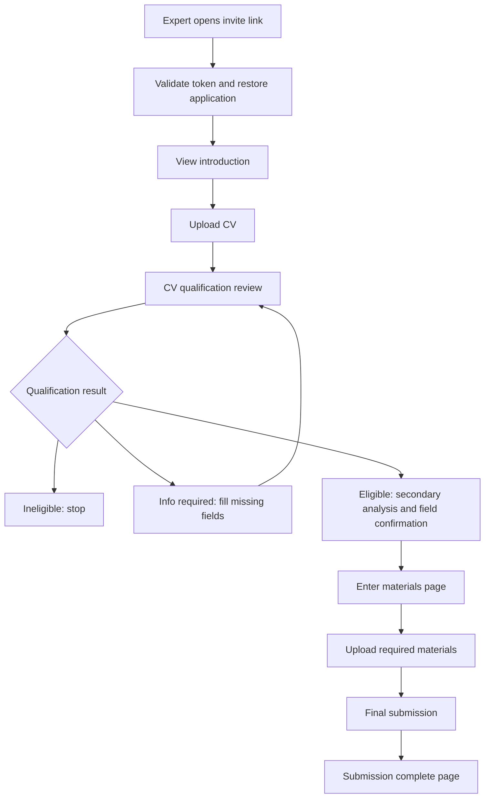
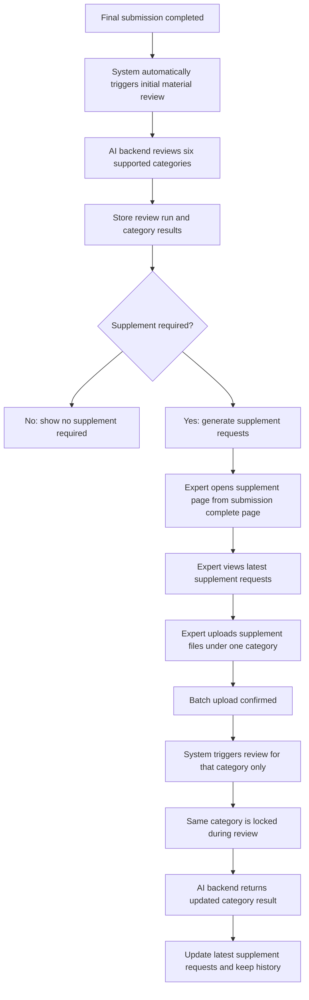

# Lean PRD / Feature Spec

## 1. 背景

当前 AutoHire 已完成专家邀约、token 身份恢复、简历资格判断、进一步分析、材料上传与最终提交的主流程。

现有系统主要解决：

- 专家通过邀约链接进入系统
- 系统识别专家身份并恢复申请进度
- 专家上传简历并完成资格判断
- 专家上传基础证明材料
- 专家最终提交申请

后续需要增加一套 AI 材料补件能力，用于在专家最终提交后，对已提交材料进行 AI 完整性审查，并在发现材料缺失、不符合要求或需要额外证明时，引导专家继续补充材料。

该能力不是替代现有简历资格判断，也不改变当前专家最终提交主流程。它是提交后的补件闭环：

```text
专家最终提交 -> AI 审查已提交材料 -> 生成补件需求 -> 专家进入补件页面 -> 上传补件材料 -> 按类别再次审查 -> 更新补件结果
```

## 2. 产品定位

该功能定位为 AutoHire 当前专家申报系统的后续阶段扩展：

**提交后的 AI 材料补件闭环**

产品方向保持：

- 继续围绕现有 `Application` 申请主线展开
- 不新建割裂系统
- 不新增账号体系
- 不改变现有 `/apply/materials` 材料上传与最终提交逻辑
- 在专家提交后生成 AI 审查结果
- 通过独立补件页面承接补件需求和补件文件上传
- 补件文件与原材料上传文件独立管理
- AI 审查由外部后端服务执行，当前 Next.js Route Handler 只负责触发、读取和展示结果

当前系统：

```text
简历资格判断 -> 材料上传 -> 最终提交
```

新增后：

```text
简历资格判断 -> 材料上传 -> 最终提交 -> AI 材料审查 -> 补件需求 -> 专家补传 -> 再次审查
```

## 3. 用户角色

### 3.1 受邀专家

主要用户。专家通过邀约链接进入系统，完成申请提交后，可以在提交完成页进入补件页面，查看 AI 生成的补件需求，并上传对应补件材料。

核心诉求：

- 提交后知道是否还需要补充材料
- 理解为什么需要补充
- 能按 AI 生成的英文说明上传补件材料
- 能查看最新补件状态
- 能查看历史审查记录
- 不需要注册账号

### 3.2 AutoHire 前端与 BFF

当前 Next.js 应用负责：

- 展示提交完成页的补件入口
- 展示独立补件页面
- 调用后端接口触发审查
- 上传补件文件
- 读取审查结果与历史记录
- 根据状态禁用正在审查类别的上传操作

Next.js Route Handler 不直接执行 AI 审查。

### 3.3 AI 材料审查后端服务

外部后端服务负责：

- 创建审查任务
- 管理审查队列
- 控制并发
- 控制超时与重试
- 管理提示词
- 执行首轮审查与后续多轮类别审查
- 获取并解析 AI 输出结果
- 返回结构化审查结果给当前项目

### 3.4 运营 / 审核人员

人工复核暂不进入第一阶段范围，后续再添加。

## 4. 产品目标

### 4.1 第一阶段目标

完成提交后的站内 AI 补件闭环：

- 专家最终提交后，系统自动触发首轮材料审查
- 仅审查指定的 6 类材料
- AI 根据简历中提取出的信息、对应类别默认提示词、对应类别已提交材料内容进行审查
- 审查结果长期保存入库
- 系统生成英文补件需求
- 专家可在独立补件页面查看最新补件需求
- 专家可按类别上传补件材料
- 补件上传后自动触发对应类别的后续审查
- 后续审查以该类别一整轮对话为上下文，仅追加新提示词和补充文件内容
- 每一轮审查结果全部保留，专家默认看到最新状态，并可查看历史记录

### 4.2 不追求的目标

- 不在提交前阻止专家提交
- 不把补件文件混入原 `/apply/materials` 材料分类列表
- 不建设账号系统
- 不建设人工复核后台
- 不建设邮件通知闭环
- 不做多语言，第一阶段仅英文

## 5. 功能范围

### 5.1 第一阶段范围

包含：

1. 提交完成后自动触发首轮 AI 材料审查
2. 新增审查专属状态
3. 新增审查 run 与类别审查结果保存
4. 新增补件需求保存
5. 新增补件文件上传
6. 新增独立补件页面
7. 支持按类别上传补件材料
8. 上传新补件材料后，仅触发对应类别再次审查
9. 同类别审查中禁止继续上传该类别补件文件
10. 多个文件连续上传时，批量确认完成后审查一次
11. 支持每个申请默认最多 3 轮补件审查
12. 支持单次单类别最多处理 10 个文件
13. 支持同文件名 + 同文件大小去重
14. 缓存类别审查结果
15. 审查结果长期保存
16. 旧补件需求保留历史
17. 专家可查看最新状态和历史记录

### 5.2 审查材料类别范围

第一阶段仅审查以下类别：

- 身份证明
- 学历证明
- 工作证明
- 项目证明
- 专利证明
- 荣誉证明

不审查：

- Product Documents
- Paper Documents
- Book Documents
- Conference Documents
- 其他未列出的材料类别

### 5.3 后续阶段范围

后续可扩展：

- 邮件通知专家补件
- 补件邮件正文生成
- 邮件发送、打开、点击记录
- 人工复核后台
- 人工修改或关闭 AI 补件需求
- 专家账号或专家门户
- 多语言
- 更复杂的文件预览与人工审阅

## 6. 非功能范围

第一阶段不包含：

- 不新增账号注册、登录、找回密码、MFA
- 不新增完整人工审核后台
- 不新增邮件发送与邮件追踪
- 不改变现有简历资格判断逻辑
- 不允许专家在最终提交后重新上传简历
- 不让专家重新进入原材料上传流程修改已提交材料
- 不让补件上传文件出现在原 `/apply/materials` 材料分类列表
- 不审查 Product Documents
- 不审查 Paper、Book、Conference 等扩展类别
- 不由当前 Next.js Route Handler 直接跑 AI 审查
- 不控制 AI 输出结构，AI 输出获取与解析由后端服务负责
- 不处理 AI 审查并发、队列、超时和重试，均由后端服务控制
- 不做敏感或强硬措辞过滤
- 不做隐私/合规脱敏
- 不做多语言，仅英文

## 7. 用户流程

### 7.1 当前主流程



### 7.2 新增补件流程



### 7.3 首轮审查流程

1. 专家在 `/apply/materials` 点击最终提交。
2. 申请状态进入 `SUBMITTED`。
3. 页面跳转至 `/apply/submission-complete`。
4. 系统自动触发首轮 AI 材料审查。
5. 后端服务对 6 类材料创建审查任务。
6. 每个类别使用：
   - 该类别默认提示词
   - 简历中提取出的信息
   - 该类别下所有已提交材料文件内容
7. 若简历中未提取出某类别对应信息，仍执行审查；此时判断主要由提示词和证明材料内容控制。
8. 审查结果返回当前系统并入库。
9. 专家可从 `/apply/submission-complete` 点击进入独立补件页面查看结果。

### 7.4 后续类别补件流程

1. 专家进入补件页面。
2. 专家在某个类别下查看最新补件需求。
3. 专家点击该类别的上传按钮。
4. 专家选择一个或多个补件文件。
5. 前端校验文件类型、大小、数量。
6. 批量上传完成并确认。
7. 系统仅触发该类别的后续审查。
8. 该类别进入审查中状态，禁止继续上传该类别文件。
9. 其他非审查中类别仍可操作。
10. 后端在同一类别的一整轮对话中追加新提示词和补充文件内容。
11. 返回新的类别审查结果。
12. 页面展示最新原因和最新补件状态。
13. 已满足需求默认隐藏，但可在历史记录中查看。

## 8. 功能模块说明

### 8.1 AI 审查触发模块

#### 目标

在专家最终提交后自动触发首轮 AI 材料审查；在专家补充某类别文件后，自动触发该类别再次审查。

#### 触发规则

- 首轮审查：专家最终提交后系统自动触发。
- 后续审查：专家在补件页面上传某类别补件文件后自动触发。
- 后续审查仅针对上传文件所属类别。
- 多文件连续上传时，批量上传完成确认后只触发一次审查。
- 某类别审查中，禁止继续上传该类别文件。
- 其他类别不受影响。

#### 轮次限制

- 每个申请默认最多 3 轮补件审查。
- 轮次限制作为可配置占位，后续可调整。
- 达到轮次上限后，页面应提示无法继续自动审查，后续处理方式待后续人工复核阶段补充。

### 8.2 审查类别配置模块

#### 目标

定义第一阶段参与 AI 审查的材料类别。

#### 第一阶段审查类别

| 类别 | 英文展示 | 是否审查 |
| --- | --- | --- |
| 身份证明 | Identity Documents | 是 |
| 学历证明 | Education Documents | 是 |
| 工作证明 | Employment Documents | 是 |
| 项目证明 | Project Documents | 是 |
| 专利证明 | Patent Documents | 是 |
| 荣誉证明 | Honor Documents | 是 |
| Product Documents | Product Documents | 否 |
| Paper Documents | Paper Documents | 否 |
| Book Documents | Book Documents | 否 |
| Conference Documents | Conference Documents | 否 |

#### 提示词管理

- 提示词由后端服务管控。
- 当前项目不建设提示词管理页面。
- 首轮审查使用每个类别默认提示词。
- 后续多轮审查使用多轮审查提示词。

### 8.3 首轮类别审查模块

#### 输入

每个类别首轮审查输入：

- 类别默认提示词
- 模型提取的简历信息
- 该类别下所有原始已提交材料文件内容
- 类别名称
- application 上下文

#### 规则

- 不使用专家修订的 `SecondaryAnalysisFieldValue.effectiveValue`。
- 使用模型提取的简历信息作为审查来源。
- 如果简历中未提取出对应类别信息，依旧执行该类别审查。
- 无简历类别信息时，模型根据提示词和材料内容判断是否需要补件。

### 8.4 后续多轮类别审查模块

#### 输入

后续某类别审查输入：

- 该类别上一轮对话上下文
- 多轮审查提示词
- 本轮新增补件文件内容
- 类别名称

#### 规则

- 每个类别的审查应在一整轮对话中延续。
- 后续审查只上传新提示词和补充文件内容。
- 仅更新本类别最新结果。
- 旧结果保留在历史记录中。
- 如果原因变化，专家端展示新一轮原因。
- 已满足需求默认隐藏，可在历史记录查看。

### 8.5 补件需求模块

#### 目标

保存并展示 AI 生成的英文补件需求。

#### 补件需求字段

- 需求 ID
- application ID
- 审查 run ID
- 类别
- 标题
- 英文说明
- 缺失或不符合要求的原因
- 建议上传的材料类型
- 当前状态
- 创建时间
- 更新时间
- 是否为最新需求
- 是否已满足
- 历史版本关联

#### 状态

- `PENDING`：待补充
- `UPLOADED_WAITING_REVIEW`：已上传，等待审查
- `REVIEWING`：审查中
- `SATISFIED`：已满足
- `HIDDEN_SATISFIED`：已满足并默认隐藏
- `HISTORY_ONLY`：历史记录，仅供查看

说明：

- AI 审查默认不会失败。
- 文件不符合要求时由前端上传前拦截。
- 后端部分类别失败会自动重试，返回当前项目时默认全部成功。
- 暂不考虑 `NEEDS_MANUAL_REVIEW`。
- 暂不考虑人工豁免。

### 8.6 补件文件上传模块

#### 目标

专家在独立补件页面上传补件文件，文件独立于原 `/apply/materials` 材料列表。

#### 规则

- 补件文件不会出现在原材料分类列表。
- 原材料分类上传文件不会影响补件文件。
- 专家传错文件后，可以在该轮审查触发前删除并重新上传。
- 点击类别下方对应提交/审查按钮后，相当于触发该轮审查。
- 该轮次触发后不允许再修改本轮文件。
- 某类别审查中，禁止上传该类别新文件。
- 同文件名 + 同文件大小视为重复文件，只保留一个。
- 单次单类别最多处理 10 个文件。
- 单文件大小由前端上传限制控制。
- 不支持文件类型和大小不符合要求的文件进入上传。

### 8.7 文件可读性模块

#### 规则

- 文件上传页显示明确文件要求。
- 不支持的文件类型在前端拦截。
- 文件大小不符合要求在前端拦截。
- 符合要求的文件默认可以读取。
- 文件解析通过前置设置默认不会失败。
- 无法读取时不传给视觉模型。

### 8.8 审查结果历史模块

#### 目标

长期保存每一轮审查结果和旧补件需求。

#### 规则

- 每一轮审查结果全部入库。
- 旧补件需求保留历史。
- 专家默认看到最新补件状态。
- 专家可以查看历史记录。
- 历史记录应展示每轮原因、状态、上传文件和审查时间。
- 不涉及隐私/合规脱敏。

### 8.9 缓存与去重模块

#### 规则

- 缓存类别审查结果。
- 相同类别、相同输入条件下可复用缓存结果。
- 专家上传同文件名、同文件大小的文件时，仅当作一个文件。
- 具体文件内容 hash 是否参与去重由后端决定。

## 9. 页面规格

### 9.1 `/apply/materials`：现有材料上传页

#### 定位

保持当前材料上传页，不升级为补件工作台。

#### 变化

- 保留当前分类材料上传能力。
- 保留最终提交按钮。
- 不在该页展示补件文件。
- 不在该页处理补件上传。
- 专家点击最终提交后跳转 `/apply/submission-complete`。
- 最终提交后系统自动触发首轮 AI 审查。

#### 提交规则

- 后续 AI 审查不影响专家当前最终提交。
- 提交前仍沿用现有最低材料要求。
- AI 补件需求不会阻止当前最终提交，因为补件发生在提交后。

### 9.2 `/apply/submission-complete`：提交完成页

#### 定位

提交完成页继续提示专家申请已收到，同时新增补件入口。

#### 页面内容

字段：

- 提交成功标题
- 当前申请提交时间
- 联系方式提示
- 等待后续处理说明
- AI 材料审查状态摘要

按钮：

- `View supplement requests`
- `Refresh status`

状态：

- `未检查`：提交后审查尚未开始或尚未返回
- `检查中`：AI 正在检查材料
- `无需补件`：当前没有补件需求
- `需要补件`：存在待补件需求
- `审查失败`：理论上不返回失败；如出现异常，提示稍后刷新

交互：

- 页面加载后读取最新审查状态。
- 如果首轮审查尚未触发，系统自动触发。
- 检查中可轮询状态。
- 点击 `View supplement requests` 进入独立补件页面。

### 9.3 `/apply/supplement`：补件页面

#### 定位

独立补件页面，展示提交后的 AI 补件需求和补件文件上传能力。

#### 顶部区域

字段：

- 页面标题：`Supplement Materials`
- 当前申请状态
- 最新审查时间
- 当前待补件数量
- 已满足补件数量
- 剩余审查轮次

按钮：

- `Refresh`
- `View history`
- `Back to submission summary`

#### 类别分组

仅展示 6 个审查类别：

- Identity Documents
- Education Documents
- Employment Documents
- Project Documents
- Patent Documents
- Honor Documents

每个类别展示：

- 类别名称
- 类别最新审查状态
- 最新 AI 英文说明
- 当前待补件需求
- 本类别补件上传入口
- 本类别历史记录入口

#### 类别状态

- `NO_MATERIALS_NOT_REVIEWED`：无材料、未检查
- `HAS_MATERIALS_NOT_REVIEWED`：有材料、未检查
- `REVIEWING`：有材料、检查中
- `REVIEW_FAILED`：有材料、检查失败
- `NO_REQUESTS_BUT_REVIEW_FAILED`：无补件需求但审查失败
- `ALL_REQUESTS_SATISFIED`：有补件需求但全部已满足
- `READ_ONLY_SUBMITTED`：提交后只读查看
- `TOKEN_EXPIRED_FROM_EMAIL`：token 失效后从补件邮件进入
- `SUPPLEMENT_REQUIRED`：需要补件
- `NO_SUPPLEMENT_REQUIRED`：无需补件

说明：

- AI 审查默认不会失败；失败状态作为兜底展示。
- 邮件通知后续再做，但预留 token 失效后从补件邮件进入的错误状态。

#### 补件需求卡片

字段：

- 需求标题
- 所属类别
- AI 生成英文原因
- 建议上传材料
- 当前状态
- 最近更新时间

按钮：

- `Upload files`
- `Remove`
- `Submit for review`
- `View history`

交互：

- 用户选择文件后，先展示待上传列表。
- 用户可在触发审查前删除传错文件。
- 用户点击 `Submit for review` 后，该类别进入审查中。
- 审查中，该类别上传按钮禁用。
- 审查返回后刷新该类别最新需求。
- 已满足需求默认隐藏。
- 历史中可查看已满足或旧原因。

### 9.4 `/apply/supplement/history` 或历史弹窗

#### 定位

查看补件审查历史。

#### 展示内容

- 审查轮次
- 审查类别
- 审查时间
- 当轮上传文件
- 当轮 AI 英文原因
- 当轮补件需求
- 当轮状态

#### 交互

- 默认按时间倒序
- 可按类别筛选
- 已满足需求可在历史中查看

具体实现为独立页面还是弹窗待 UI 实现阶段确定。

## 10. 账号与权限

### 10.1 账号策略

第一阶段不新增账号体系，继续使用：

```text
invite token + HttpOnly session
```

原因：

- 当前业务是邀约制
- 一个 token 已经能定位 invitation 和 application
- 专家只需要完成自己的申报和补件
- 补件流程可以通过原链接恢复
- 引入账号会增加不必要复杂度

### 10.2 权限规则

所有补件相关接口必须校验：

- session 是否有效
- `applicationId` 是否属于当前 session
- 当前申请是否已 `SUBMITTED`
- 补件需求是否属于当前申请
- 补件文件是否属于当前申请
- 上传类别是否属于 6 个支持审查类别
- 当前类别是否正在审查中

### 10.3 token 失效

如果专家从未来补件邮件进入且 token 失效：

- 页面展示链接失效提示
- 不展示申请数据
- 提示使用最新访问链接或联系项目方
- 重新发送链接后续再做

## 11. 数据需求

### 11.1 建议新增数据对象

#### MaterialReviewRun

一次申请维度的材料审查运行。

字段：

- `id`
- `applicationId`
- `runNo`
- `status`
- `triggerType`
- `triggeredCategory`
- `startedAt`
- `finishedAt`
- `createdAt`
- `updatedAt`

状态建议：

- `QUEUED`
- `PROCESSING`
- `COMPLETED`
- `FAILED`

说明：

- 失败状态作为兜底，正常后端默认返回成功。
- 首轮 run 覆盖 6 个类别。
- 后续 run 可只覆盖单个类别。

#### MaterialCategoryReview

某个 run 下某个类别的审查结果。

字段：

- `id`
- `reviewRunId`
- `applicationId`
- `category`
- `roundNo`
- `status`
- `aiMessage`
- `resultPayload`
- `isLatest`
- `startedAt`
- `finishedAt`
- `createdAt`
- `updatedAt`

说明：

- 保存每一轮类别审查结果。
- `aiMessage` 为专家端展示英文文案。
- `resultPayload` 保存后端返回的结构化结果。

#### SupplementRequest

AI 生成的补件需求。

字段：

- `id`
- `applicationId`
- `category`
- `reviewRunId`
- `categoryReviewId`
- `title`
- `reason`
- `suggestedMaterials`
- `aiMessage`
- `status`
- `isLatest`
- `isSatisfied`
- `createdAt`
- `updatedAt`
- `satisfiedAt`

状态建议：

- `PENDING`
- `UPLOADED_WAITING_REVIEW`
- `REVIEWING`
- `SATISFIED`
- `HISTORY_ONLY`

#### SupplementFile

补件上传文件。

字段：

- `id`
- `applicationId`
- `category`
- `supplementRequestId`
- `fileName`
- `objectKey`
- `fileType`
- `fileSize`
- `uploadBatchId`
- `reviewRunId`
- `isDeleted`
- `deletedAt`
- `uploadedAt`
- `createdAt`

说明：

- 补件文件独立于 `ApplicationMaterial`。
- 不出现在原材料分类列表。
- 同文件名 + 同文件大小去重。

#### SupplementUploadBatch

一次批量补件上传。

字段：

- `id`
- `applicationId`
- `category`
- `status`
- `fileCount`
- `confirmedAt`
- `reviewRunId`
- `createdAt`
- `updatedAt`

状态建议：

- `DRAFT`
- `CONFIRMED`
- `REVIEWING`
- `COMPLETED`

### 11.2 复用现有数据对象

继续复用：

- `Application`
- `ResumeFile`
- `ResumeAnalysisResult`
- `ApplicationMaterial`
- `ApplicationEventLog`
- `FileUploadAttempt`

### 11.3 Application 状态

需要新增审查专属状态，但不一定改动主 `ApplicationStatus`。

建议新增独立材料审查状态，而不是让 `ApplicationStatus` 过度膨胀。

可在 `Application` 或单独快照中提供：

- `materialSupplementStatus`
- `latestMaterialReviewRunId`

状态建议：

- `NOT_STARTED`
- `REVIEWING`
- `SUPPLEMENT_REQUIRED`
- `NO_SUPPLEMENT_REQUIRED`
- `PARTIALLY_SATISFIED`
- `SATISFIED`

## 12. 异常情况

### 12.1 无材料、未检查

场景：

- 专家已提交，但某审查类别没有任何原材料。

处理：

- 该类别仍可参与首轮审查。
- AI 根据提示词和无材料状态判断是否生成补件需求。
- 页面展示该类别未提供材料或需要补件。

### 12.2 有材料、未检查

场景：

- 已有材料，但首轮审查尚未返回。

处理：

- 页面展示等待检查。
- 系统自动触发或继续轮询。

### 12.3 有材料、检查中

处理：

- 页面展示检查中。
- 正在检查的类别上传按钮禁用。
- 其他类别可继续操作。

### 12.4 有材料、检查失败

处理：

- 理论上后端自动重试并默认返回成功。
- 如仍返回失败，页面展示兜底错误。
- 用户可刷新。

### 12.5 无补件需求但审查失败

处理：

- 展示审查暂时不可用。
- 不显示“无需补件”结论。
- 提供刷新入口。

### 12.6 有补件需求但全部已满足

处理：

- 页面默认展示无需继续补件。
- 已满足需求默认隐藏。
- 用户可在历史记录查看。

### 12.7 提交后只读查看

处理：

- 原 `/apply/materials` 仍是提交后回顾。
- 补件页面允许补件上传。
- 原材料上传列表不再修改。

### 12.8 token 失效后从补件邮件进入

处理：

- 不展示申请数据。
- 展示链接失效提示。
- 邮件通知后续再做，当前仅预留状态。

### 12.9 文件不符合要求

处理：

- 前端上传前拦截。
- 不创建补件文件记录。
- 不触发审查。

### 12.10 上传同名同大小文件

处理：

- 视为重复文件。
- 只保留一个。
- 页面提示已去重。

### 12.11 达到审查轮次上限

处理：

- 默认每申请最多 3 轮。
- 达到上限后，不再自动触发审查。
- 页面提示已达到补件审查次数上限。
- 后续处理待人工复核阶段设计。

## 13. 验收标准

### 13.1 提交后首轮审查

- 专家在 `/apply/materials` 完成最终提交后，申请进入 `SUBMITTED`。
- 页面跳转 `/apply/submission-complete`。
- 系统自动触发首轮 AI 材料审查。
- 首轮审查仅覆盖 6 个支持类别。
- Product、Paper、Book、Conference 不参与审查。

### 13.2 审查输入

- 首轮审查使用类别默认提示词。
- 首轮审查使用模型提取的简历信息。
- 首轮审查使用对应类别下所有原始提交材料文件内容。
- 不使用专家修订的 `SecondaryAnalysisFieldValue.effectiveValue`。
- 简历中未提取出某类别信息时，该类别仍执行审查。

### 13.3 补件页面

- `/apply/submission-complete` 提供进入补件页面的按钮。
- 补件页面仅展示 6 个审查类别。
- 专家可以看到最新补件需求。
- 已满足需求默认隐藏。
- 专家可以查看历史记录。

### 13.4 补件上传

- 专家可在某类别下上传一个或多个补件文件。
- 文件类型或大小不符合要求时，前端拦截。
- 同文件名 + 同大小文件去重。
- 单次单类别最多处理 10 个文件。
- 批量上传确认后仅触发一次该类别审查。

### 13.5 类别审查锁定

- 某类别审查中，该类别上传按钮禁用。
- 某类别审查中，其他类别仍可操作。
- 审查返回后，该类别恢复可操作状态。

### 13.6 后续多轮审查

- 上传补件后仅审查上传文件所属类别。
- 后续审查在该类别一整轮对话中延续。
- 后续审查仅追加新提示词和补充文件内容。
- 新一轮原因变化时，专家端展示新一轮原因。
- 旧结果保留在历史记录中。

### 13.7 数据保存

- 每一轮审查结果长期保存入库。
- 每一轮类别审查结果长期保存。
- 旧补件需求保留历史。
- 专家默认看到最新状态。
- 专家可查看历史。

### 13.8 权限

- 未登录或 session 无效时不能访问补件数据。
- 当前申请必须属于当前 session。
- 非 `SUBMITTED` 申请不能进入补件流程。
- 不支持审查类别不能上传补件文件。
- 正在审查中的类别不能继续上传。

### 13.9 异常状态

页面需要覆盖并展示：

- 无材料、未检查
- 有材料、未检查
- 有材料、检查中
- 有材料、检查失败
- 无补件需求但审查失败
- 有补件需求但全部已满足
- 提交后只读查看
- token 失效后从补件邮件进入

## 14. 待确认问题

1. 每个申请默认最多 3 轮补件审查，达到上限后的业务处理文案是否需要现在确定？
2. 补件页面路径是否确定为 `/apply/supplement`，还是使用 `/apply/submission-complete/supplement`？
3. 历史记录使用独立页面还是弹窗？
4. 补件需求是否必须绑定某一条具体补件 request，还是只按类别上传即可？
5. 同一类别下多个补件需求时，用户上传文件后是否默认用于该类别所有待补件需求？
6. 后端返回给当前项目的审查结果字段最终结构是什么？
7. 当前项目是否只保存后端返回结构，还是需要拆成多张业务表？
8. 文件大小、类型的前端限制具体值是多少？
9. 单次单类别最多 10 个文件，超过后是禁止选择还是选择后提示删除？
10. 专家端英文补件文案是否完全由 AI 生成，还是需要系统模板包裹？
11. `materialSupplementStatus` 放在 `Application` 表，还是单独由最新 `MaterialReviewRun` 推导？
12. 后端服务接口鉴权方式是什么？
13. 后端服务创建审查任务后，当前项目通过轮询读取，还是后端回调写入？
14. 审查结果缓存命中时，是否仍创建新的历史记录？
15. 补件文件删除后是否需要保留删除审计时间？
