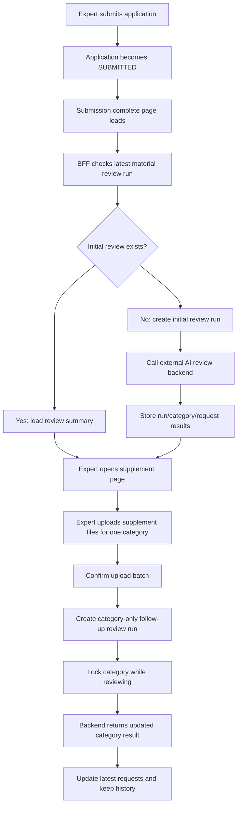
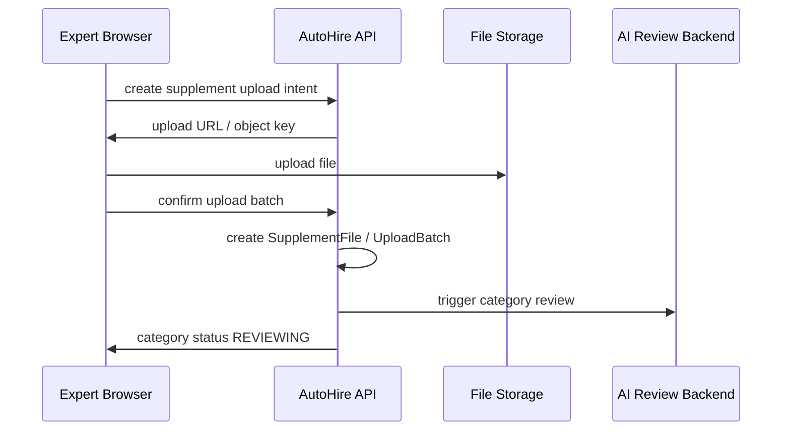

# Light RFC：AI Material Supplement

## 1. 当前目标

本 RFC 目标是为 AutoHire 增加“提交后的 AI 材料补件闭环”。

核心目标：

- 专家在现有 `/apply/materials` 完成最终提交后，系统自动触发首轮 AI 材料审查。
- AI 审查仅覆盖 6 个类别：Identity、Education、Employment、Project、Patent、Honor。
- 审查结果和补件需求长期保存。
- 专家可从 `/apply/submission-complete` 进入新增 `/apply/supplement` 页面查看补件需求。
- 专家可按类别上传补件文件。
- 补件文件上传后，仅触发对应类别的后续审查。
- 同类别审查中禁止继续上传该类别补件文件。
- 每个申请默认最多 3 轮补件审查。
- 单次单类别最多处理 10 个补件文件。
- 已满足需求默认隐藏，但保留历史记录。

明确不做：

- 不改变当前提交前材料上传流程。
- 不让 AI 补件需求阻止当前最终提交。
- 不新增账号体系。
- 不做邮件通知。
- 不做人工复核后台。
- 不做多语言，第一阶段仅英文。
- 不由当前 Next.js Route Handler 直接执行 AI 审查。

## 2. 技术实现总览

### 2.1 技术栈

用户提供的技术栈暂定项如下。未提供具体选型的部分按要求标记为【待确认】。

| 项目 | 暂定技术栈 |
| --- | --- |
| 前端 | 【待确认】 |
| 后端 | 【待确认】 |
| 数据库 | 【待确认】 |
| ORM | 【待确认】 |
| 部署环境 | 【待确认】 |
| AI 模型调用方式 | 【待确认】 |
| 文件存储方式 | 【待确认】 |

说明：

- 当前仓库已有 Next.js、Route Handler、Prisma、PostgreSQL、OSS/mock storage 等实现背景，但本 RFC 不把这些视为用户已确认的新功能技术栈。
- 本 RFC 只描述模块边界和接口职责，具体技术选型以待确认项最终结果为准。

### 2.2 系统边界

当前项目负责：

- 展示提交完成页 AI 审查摘要。
- 展示补件页面与补件历史页面。
- 维护补件状态、补件文件、审查结果的本地数据。
- 调用外部 AI 审查后端服务创建审查任务或读取结果。
- 提供专家端补件文件上传 intent 和确认接口。
- 校验 session、application 归属、申请状态、类别状态。

外部 AI 审查后端服务负责：

- 管理提示词。
- 创建审查任务。
- 管理队列、并发、超时、重试。
- 执行 AI 模型调用。
- 获取并解析 AI 输出。
- 返回结构化审查结果和专家端英文文案。

### 2.3 推荐流程架构



### 2.4 状态管理原则

- `ApplicationStatus` 继续以 `SUBMITTED` 表示申请主流程完成。
- AI 补件审查使用独立状态，不建议把所有补件状态塞进主申请状态机。
- 补件页面只允许 `SUBMITTED` 申请访问。
- 原材料和补件材料分开保存、分开展示。

## 3. 前端模块设计

### 3.1 页面模块

#### `/apply/materials`

现有材料上传页。

改动：

- 保持当前材料上传、删除、提交能力。
- 不展示补件文件。
- 不展示补件上传入口。
- 提交成功后跳转 `/apply/submission-complete`。
- AI 审查不会阻止最终提交。

#### `/apply/submission-complete`

提交完成页。

新增：

- AI 材料审查状态摘要。
- `View supplement requests` 按钮。
- `Refresh status` 按钮。
- 页面加载时检查首轮审查 run；若不存在则触发首轮审查。

#### `/apply/supplement`

新增补件页面。

职责：

- 展示 6 个支持审查类别。
- 展示每个类别最新 AI 英文说明。
- 展示当前待补件需求。
- 支持按类别选择补件文件。
- 批量确认后触发该类别后续审查。
- 审查中锁定当前类别上传入口。
- 已满足需求默认隐藏。

#### `/apply/supplement/history`

新增补件历史页。

职责：

- 展示每一轮审查历史。
- 支持按类别筛选。
- 支持查看旧原因、已满足需求、历史上传文件。

### 3.2 前端数据客户端

建议新增补件专属 client 模块，例如：

```text
src/features/material-supplement/client.ts
```

职责：

- `fetchSupplementSummary()`
- `fetchSupplementSnapshot()`
- `fetchSupplementHistory()`
- `createInitialReviewRun()`
- `createSupplementUploadIntent()`
- `confirmSupplementUploadBatch()`
- `deleteDraftSupplementFile()`
- `triggerCategoryReview()`

### 3.3 前端类型模块

建议新增：

```text
src/features/material-supplement/types.ts
```

核心类型：

- `MaterialSupplementStatus`
- `MaterialReviewRunStatus`
- `MaterialCategoryReviewStatus`
- `SupplementRequestStatus`
- `SupplementCategory`
- `SupplementSnapshot`
- `SupplementCategorySnapshot`
- `SupplementRequest`
- `SupplementFile`
- `SupplementHistoryItem`

### 3.4 前端状态交互

补件页面需要处理：

- 全局 loading：恢复申请和补件状态。
- 类别 loading：某类别文件上传中或审查中。
- 类别锁定：`REVIEWING` 时禁用该类别上传、删除、提交。
- 去重提示：同文件名 + 同文件大小只保留一个。
- 数量限制：单次单类别最多 10 个文件。
- 轮次限制：剩余轮次为 0 时禁用提交审查。

### 3.5 前端校验

文件上传前校验：

- 类别必须属于 6 个支持审查类别。
- 单次单类别文件数量不超过 10。
- 文件类型必须符合前端配置，具体值【待确认】。
- 文件大小必须符合前端配置，具体值【待确认】。
- 同文件名 + 同文件大小去重。
- 审查中类别不可上传。
- 无待上传文件时不可 `Submit for review`。

## 4. 后端模块设计

### 4.1 BFF / API 模块

当前项目后端层负责：

- 校验专家 session。
- 校验 application 归属。
- 校验申请是否 `SUBMITTED`。
- 查询和保存补件审查数据。
- 生成补件文件 upload intent。
- 确认补件文件上传。
- 创建本地审查 run。
- 调用外部 AI 审查后端服务。
- 接收或拉取审查结果并入库。

### 4.2 业务服务模块

建议新增服务模块：

```text
src/lib/material-supplement/service.ts
```

职责：

- `getSupplementSummary(applicationId)`
- `getSupplementSnapshot(applicationId)`
- `getSupplementHistory(applicationId, filters)`
- `ensureInitialReviewRun(applicationId)`
- `createSupplementUploadIntent(input)`
- `confirmSupplementUploadBatch(input)`
- `triggerCategoryReview(input)`
- `syncReviewRunResult(input)`
- `assertSupplementAccess(input)`
- `assertCategoryNotReviewing(input)`
- `assertReviewRoundLimit(input)`

### 4.3 外部 AI 审查服务客户端

建议新增：

```text
src/lib/material-review/client.ts
```

职责：

- 调用外部服务创建首轮审查。
- 调用外部服务创建类别后续审查。
- 读取审查任务状态。
- 读取审查结果。

接口形式待确认：

- 当前项目轮询外部后端。
- 外部后端回调当前项目。
- 或两者都支持。

### 4.4 数据访问模块

建议在现有 data/store 或 Prisma repository 中新增：

- 创建 review run。
- 查询 latest review run。
- 创建 category review。
- 更新 category review latest 标记。
- 创建 supplement request。
- 将旧 request 标记为 history。
- 创建 supplement file。
- 创建 upload batch。
- 查询补件 snapshot。
- 查询补件 history。

## 5. API 设计概览

以下为建议 API 概览，最终路径和字段可在 API Contract 中继续细化。

### 5.1 获取提交完成页审查摘要

`GET /api/applications/{applicationId}/material-supplement/summary`

用途：

- 提交完成页读取 AI 材料审查摘要。

返回建议：

```json
{
  "applicationId": "app_001",
  "status": "REVIEWING",
  "latestReviewRunId": "run_001",
  "latestReviewedAt": null,
  "pendingRequestCount": 2,
  "satisfiedRequestCount": 1,
  "remainingReviewRounds": 2
}
```

### 5.2 确保首轮审查存在

`POST /api/applications/{applicationId}/material-supplement/reviews/initial`

用途：

- 提交完成页加载时，如果首轮审查不存在，则创建首轮审查。
- 该接口应幂等。

请求：

```json
{}
```

返回：

```json
{
  "reviewRunId": "run_001",
  "status": "QUEUED",
  "created": true
}
```

### 5.3 获取补件页面快照

`GET /api/applications/{applicationId}/material-supplement`

用途：

- 补件页面读取最新状态。

返回包含：

- 顶部摘要。
- 6 个类别状态。
- 最新补件需求。
- 待上传/等待审查文件。

### 5.4 获取补件历史

`GET /api/applications/{applicationId}/material-supplement/history?category=IDENTITY&runNo=1`

用途：

- 补件历史页读取历史记录。

查询参数：

- `category` 可选。
- `runNo` 可选。

非法参数应忽略或返回 400，建议忽略并回退默认筛选。

### 5.5 创建补件上传 intent

`POST /api/applications/{applicationId}/material-supplement/upload-intent`

请求：

```json
{
  "category": "EDUCATION",
  "fileName": "phd-degree.pdf",
  "fileType": "application/pdf",
  "fileSize": 123456,
  "uploadBatchId": "batch_001"
}
```

校验：

- application 必须 `SUBMITTED`。
- category 必须是 6 个支持类别。
- 当前类别不能 `REVIEWING`。
- 文件类型和大小必须合法，具体规则【待确认】。
- 同名同大小去重。

### 5.6 确认补件上传批次

`POST /api/applications/{applicationId}/material-supplement/upload-batches/{batchId}/confirm`

用途：

- 批量补件文件上传完成后确认。
- 触发该类别后续审查。

返回：

```json
{
  "uploadBatchId": "batch_001",
  "category": "EDUCATION",
  "fileCount": 3,
  "reviewRunId": "run_002",
  "status": "REVIEWING"
}
```

### 5.7 删除草稿补件文件

`DELETE /api/applications/{applicationId}/material-supplement/files/{fileId}`

用途：

- 删除尚未触发审查的待上传补件文件。

限制：

- 已确认并进入审查的文件不可删除。
- 审查中的类别不可删除本轮文件。

### 5.8 同步审查结果

两种模式待确认。

模式 A：当前项目轮询外部后端：

`POST /api/applications/{applicationId}/material-supplement/reviews/{reviewRunId}/sync`

模式 B：外部后端回调当前项目：

`POST /api/internal/material-supplement/reviews/{reviewRunId}/callback`

需要确认：

- 外部服务鉴权方式。
- 回调签名方式。
- 重放保护。
- 回调失败重试策略。

## 6. 数据库设计概览

以下为概览设计，字段名可在 schema 设计阶段调整。

### 6.1 MaterialReviewRun

用途：记录一次申请维度的审查运行。

字段：

- `id`
- `applicationId`
- `runNo`
- `status`
- `triggerType`
- `triggeredCategory`
- `externalRunId`
- `startedAt`
- `finishedAt`
- `createdAt`
- `updatedAt`

建议索引：

- `applicationId`
- `applicationId, runNo`
- `externalRunId`
- `status, updatedAt`

### 6.2 MaterialCategoryReview

用途：记录每轮每类别审查结果。

字段：

- `id`
- `reviewRunId`
- `applicationId`
- `category`
- `roundNo`
- `status`
- `aiMessage`
- `resultPayload`
- `isLatest`
- `startedAt`
- `finishedAt`
- `createdAt`
- `updatedAt`

建议索引：

- `applicationId, category`
- `applicationId, category, isLatest`
- `reviewRunId`

### 6.3 SupplementRequest

用途：记录 AI 生成的补件需求。

字段：

- `id`
- `applicationId`
- `category`
- `reviewRunId`
- `categoryReviewId`
- `title`
- `reason`
- `suggestedMaterials`
- `aiMessage`
- `status`
- `isLatest`
- `isSatisfied`
- `createdAt`
- `updatedAt`
- `satisfiedAt`

建议索引：

- `applicationId, category, isLatest`
- `applicationId, status`
- `categoryReviewId`

### 6.4 SupplementFile

用途：记录补件上传文件，独立于原 `ApplicationMaterial`。

字段：

- `id`
- `applicationId`
- `category`
- `supplementRequestId`
- `fileName`
- `objectKey`
- `fileType`
- `fileSize`
- `uploadBatchId`
- `reviewRunId`
- `isDeleted`
- `deletedAt`
- `uploadedAt`
- `createdAt`

建议索引：

- `applicationId, category`
- `applicationId, uploadBatchId`
- `applicationId, fileName, fileSize`

去重规则：

- 同一 application、同一 category、同一 fileName、同一 fileSize 可视为重复。
- 是否增加内容 hash 去重【待确认】。

### 6.5 SupplementUploadBatch

用途：记录一次补件批量上传。

字段：

- `id`
- `applicationId`
- `category`
- `status`
- `fileCount`
- `confirmedAt`
- `reviewRunId`
- `createdAt`
- `updatedAt`

建议索引：

- `applicationId, category`
- `reviewRunId`

### 6.6 Application 补充字段

建议尽量不扩展主状态机。

可选新增：

- `materialSupplementStatus`
- `latestMaterialReviewRunId`

也可以完全由最新 `MaterialReviewRun` 推导，待确认。

## 7. 账号与权限方案

### 7.1 账号策略

第一阶段不新增账号体系。

继续使用：

```text
invite token + HttpOnly session
```

### 7.2 访问控制

所有补件 API 均需校验：

- session 有效。
- `applicationId` 属于当前 session。
- 当前申请为 `SUBMITTED`。
- 上传类别属于 6 个支持审查类别。
- 当前类别不处于审查中。
- 补件 request、file、batch 均属于当前 application。

### 7.3 无权限处理

- 不返回申请和补件详情。
- 返回 401 或 403。
- 前端展示访问失效 / 无权限状态。

### 7.4 内部回调权限

若采用外部后端回调模式，内部接口必须具备：

- 服务端签名或 token 鉴权【待确认】。
- 时间戳校验【待确认】。
- 幂等处理。
- 防止重复回调覆盖新结果。

## 8. AI 调用流程

### 8.1 首轮审查

触发时机：

- 专家最终提交后。
- `/apply/submission-complete` 页面加载时确保首轮审查存在。

输入来源：

- 6 个支持审查类别。
- 每个类别默认提示词，由外部后端服务管理。
- 模型提取的简历信息。
- 该类别下所有原始已提交材料文件内容。

规则：

- 不使用专家修订的 `SecondaryAnalysisFieldValue.effectiveValue`。
- 简历中未提取出某类别信息时，仍执行该类别审查。
- Product、Paper、Book、Conference 不参与审查。

### 8.2 后续类别审查

触发时机：

- 专家在 `/apply/supplement` 某类别下批量上传补件文件并确认后。

输入来源：

- 该类别上一轮对话上下文。
- 多轮审查提示词，由外部后端服务管理。
- 本轮新增补件文件内容。

规则：

- 仅审查本类别。
- 同类别审查中禁止再次上传本类别文件。
- 其他类别不受影响。
- 新结果只更新该类别 latest 状态。
- 旧结果进入历史。

### 8.3 输出处理

外部后端服务负责：

- AI 模型调用。
- AI 输出解析。
- 生成英文专家端文案。
- 返回结构化结果。

当前项目负责：

- 保存返回结果。
- 标记旧结果为历史。
- 更新 latest request。
- 更新类别状态。

AI 输出结构由外部后端控制，最终返回字段【待确认】。

## 9. 文件上传 / 解析方案

### 9.1 原材料文件

原 `/apply/materials` 文件继续使用现有上传链路。

原材料文件：

- 参与首轮 AI 审查。
- 不在补件页面作为可编辑文件管理。
- 提交后保持只读。

### 9.2 补件文件

补件文件使用独立上传链路和独立数据表。

补件文件：

- 不写入原 `ApplicationMaterial`。
- 不出现在 `/apply/materials` 分类文件列表。
- 仅在 `/apply/supplement` 和历史页展示。

### 9.3 上传流程



### 9.4 上传校验

前端上传前拦截：

- 不支持文件类型。
- 文件大小超限。
- 单次单类别超过 10 个文件。
- 重复文件名 + 文件大小。
- 类别处于审查中。
- 轮次达到上限。

具体文件类型、大小限制【待确认】。

### 9.5 文件解析

根据 PRD 约束：

- 当前项目不负责文件解析。
- 文件解析由外部后端服务前置配置保障。
- 符合上传要求的文件默认可读取。
- 无法读取时不传给视觉模型。
- AI 审查后端默认处理失败重试，并返回当前项目成功状态。

## 10. 错误处理方案

### 10.1 前端错误

需要覆盖：

- 无材料、未检查。
- 有材料、未检查。
- 有材料、检查中。
- 有材料、检查失败。
- 无补件需求但审查失败。
- 有补件需求但全部已满足。
- 提交后只读查看。
- token 失效后从补件邮件进入。
- 文件类型不支持。
- 文件大小超限。
- 文件数量超过 10。
- 重复文件去重。
- 达到审查轮次上限。

### 10.2 API 错误

建议错误码：

- `SUPPLEMENT_ACCESS_DENIED`
- `APPLICATION_NOT_SUBMITTED`
- `SUPPLEMENT_CATEGORY_UNSUPPORTED`
- `SUPPLEMENT_CATEGORY_REVIEWING`
- `SUPPLEMENT_ROUND_LIMIT_REACHED`
- `SUPPLEMENT_FILE_TYPE_UNSUPPORTED`
- `SUPPLEMENT_FILE_SIZE_EXCEEDED`
- `SUPPLEMENT_FILE_COUNT_EXCEEDED`
- `SUPPLEMENT_UPLOAD_BATCH_NOT_FOUND`
- `SUPPLEMENT_REVIEW_TRIGGER_FAILED`
- `SUPPLEMENT_REVIEW_SYNC_FAILED`

### 10.3 幂等处理

需要幂等：

- 创建首轮审查。
- 确认上传批次。
- 触发类别审查。
- 接收外部回调或同步审查结果。

### 10.4 审查失败处理

PRD 中约定 AI 审查默认不会失败，后端自动重试并返回成功。

当前项目仍需兜底：

- 若外部服务创建任务失败，显示稍后重试。
- 若同步失败，保留上一轮 latest 状态。
- 若回调重复，忽略旧版本。
- 若 run 失败，展示 `REVIEW_FAILED` 兜底状态。

## 11. 安全注意事项

### 11.1 专家端权限

- 所有接口必须校验 session。
- 所有资源必须校验 application 归属。
- 不允许通过 fileId、batchId、requestId 访问其他申请数据。
- 非 `SUBMITTED` 申请不可访问补件流程。

### 11.2 文件安全

- 不向前端暴露长期底层存储地址。
- 上传 intent 应短期有效。
- object key 应包含 application 作用域。
- 文件删除应保留删除审计时间【待确认】。
- 是否需要病毒扫描【待确认】。

### 11.3 内部服务安全

- 外部 AI 审查服务调用需要服务端鉴权【待确认】。
- 回调接口需要签名验证【待确认】。
- 回调应具备幂等 key 或 external run id。

### 11.4 数据安全

- 审查结果长期保存。
- 不做隐私/合规脱敏是当前产品决策，但仍需避免日志中输出敏感文件内容。
- AI raw output 是否保存【待确认】。
- 文件内容是否保存到当前项目数据库【待确认】。

## 12. 部署注意事项

部署环境：【待确认】

需要关注：

- 当前项目需要能访问外部 AI 审查后端服务。
- 外部服务地址、鉴权密钥、超时配置需要环境变量。
- 文件存储配置需要支持补件文件路径前缀。
- 若采用外部回调，当前项目必须提供可被外部服务访问的 internal callback endpoint。
- 若采用轮询，需确认轮询频率和前端刷新策略。
- 数据库迁移需要在上线前执行。
- 新增 API 和页面应与现有申请流程兼容。
- 发布期间不应影响现有 `/apply/materials` 提交流程。

建议新增环境变量：

- `MATERIAL_REVIEW_BASE_URL`【待确认】
- `MATERIAL_REVIEW_API_KEY`【待确认】
- `MATERIAL_REVIEW_CALLBACK_SECRET`【待确认】
- `SUPPLEMENT_REVIEW_MAX_ROUNDS`，默认 3
- `SUPPLEMENT_UPLOAD_MAX_FILES_PER_BATCH`，默认 10
- `SUPPLEMENT_UPLOAD_ALLOWED_TYPES`【待确认】
- `SUPPLEMENT_UPLOAD_MAX_FILE_SIZE`【待确认】

## 13. 风险点

### 13.1 外部 AI 审查服务接口未定

风险：

- 当前项目 API 和数据模型会受外部返回字段影响。

缓解：

- 先定义当前项目内部 snapshot 数据结构。
- 外部结果通过 adapter 转换后入库。

### 13.2 审查结果语义不稳定

风险：

- AI 生成原因变化会影响专家理解。

缓解：

- 每轮结果长期保存。
- 页面只展示 latest。
- 历史可追溯。

### 13.3 补件文件与原材料文件混淆

风险：

- 专家或系统误以为补件文件会更新原材料列表。

缓解：

- 数据表分离。
- 页面分离。
- 文案明确补件材料是提交后的补充材料。

### 13.4 类别锁定状态不一致

风险：

- 前端允许上传，但后端已在审查中。

缓解：

- 后端以类别状态为准。
- 前端乐观禁用，后端再次校验。

### 13.5 多轮历史覆盖错误

风险：

- 新结果覆盖旧结果，导致无法查看历史。

缓解：

- 新 run 写新记录。
- 旧 request 只更新 `isLatest=false` 或历史状态，不删除。

### 13.6 轮次限制边界

风险：

- 达到 3 轮后用户无法继续补充，业务处理不明确。

缓解：

- 页面先展示上限提示。
- 后续接人工复核或运营处理。

### 13.7 文件限制未确认

风险：

- 前端无法准确拦截不支持文件。

缓解：

- 文件类型和大小作为 P0 待确认项。

## 14. 后续待确认问题

1. 前端技术栈是什么？
2. 后端技术栈是什么？
3. 数据库是什么？
4. ORM 是什么？
5. 部署环境是什么？
6. AI 模型调用方式是什么？
7. 文件存储方式是什么？
8. 外部 AI 审查后端的接口协议是什么？
9. 当前项目通过轮询读取审查结果，还是由外部后端回调写入？
10. 外部后端服务鉴权方式是什么？
11. 回调接口是否需要签名、时间戳和重放保护？
12. 后端返回给当前项目的审查结果字段最终结构是什么？
13. 当前项目只保存外部返回结构，还是拆分为多张业务表？
14. `materialSupplementStatus` 放在 `Application` 表，还是由最新 `MaterialReviewRun` 推导？
15. 补件页面路径最终确定为 `/apply/supplement` 吗？
16. 历史记录使用独立页面还是弹窗？
17. 补件需求是否必须绑定具体 request，还是只按类别上传？
18. 同一类别多个补件需求时，上传文件是否默认用于该类别所有待补件需求？
19. 文件允许类型是什么？
20. 文件大小限制是什么？
21. 单次单类别超过 10 个文件时，是禁止选择，还是选择后提示删除？
22. 专家端英文文案是否完全由 AI 生成，还是需要系统模板包裹？
23. 审查结果缓存命中时，是否仍创建新的历史记录？
24. 补件文件删除后是否需要保留删除审计时间？
25. 是否保存 AI raw output？
26. 是否保存文件解析后的文本内容？
27. 是否需要病毒扫描？
